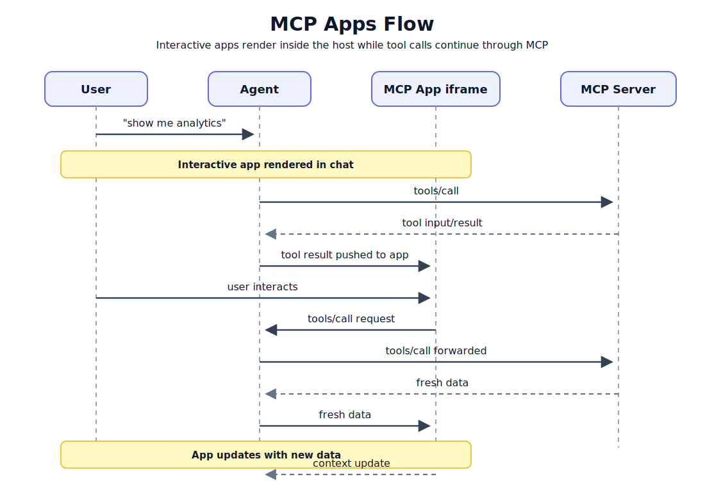
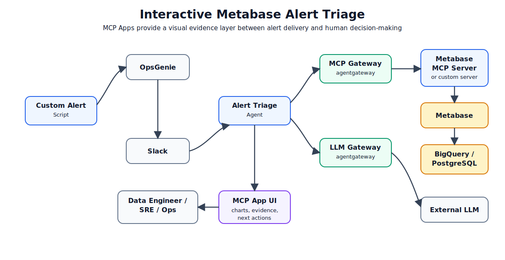
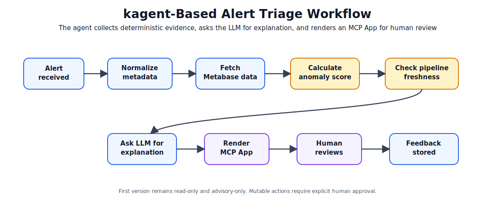
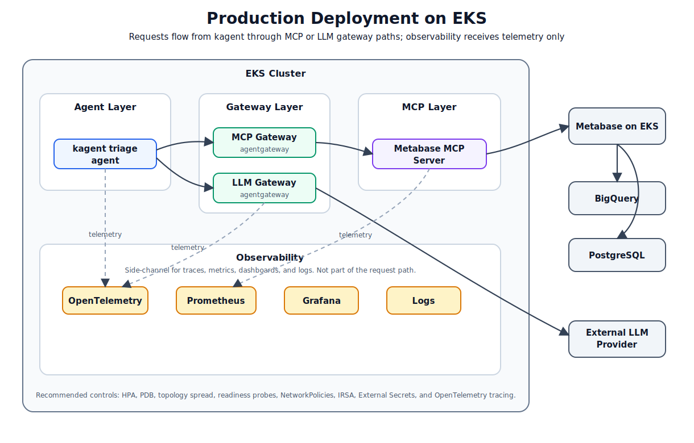

# MCP Apps

MCP Apps are an extension of the Model Context Protocol (MCP) that let an MCP
server return an interactive UI, not just text or structured data. The UI is
rendered directly inside an MCP host such as Claude Desktop, so users can work
with dashboards, forms, visualizations, media viewers, or multi-step workflows
without leaving the chat.

Source: [MCP Apps overview](https://modelcontextprotocol.io/extensions/apps/overview)

## High-Level Overview

Traditional MCP tools usually return text, images, resources, or structured
data. MCP Apps add a UI layer on top of that model. A tool can declare that it
has an associated app resource, and the host can render that app inside the
conversation.

The main idea is:

- An MCP server exposes a tool.
- The tool description points to a UI resource using `_meta.ui.resourceUri`.
- The host fetches that UI resource from the MCP server.
- The host renders the UI in a sandboxed iframe.
- The app communicates with the host through `postMessage` using a JSON-RPC
  protocol.
- The app can request MCP tool calls, receive fresh data, and update the
  conversation context.

This makes MCP Apps useful when a plain text answer is not enough. Examples
include exploring analytics, configuring deployments, reviewing documents,
monitoring live system data, or completing workflows with buttons, filters,
forms, and navigation.

## How MCP Apps Work

At a high level, MCP Apps combine two MCP primitives:

1. A tool that declares an associated UI resource.
2. A UI resource that renders an interactive HTML interface.

When the LLM decides to call a tool that supports MCP Apps, the flow looks like
this:

1. The host sees the tool's `_meta.ui.resourceUri` and may preload the UI.
2. The host fetches the `ui://` resource from the MCP server.
3. The host renders the returned HTML in a sandboxed iframe.
4. The MCP tool result is pushed into the app.
5. The user interacts with the app.
6. The app asks the host to perform actions, such as calling another MCP tool.
7. The host forwards those requests to the MCP server.
8. Fresh data is returned and the app updates in place.

## Diagram



## Why Use MCP Apps Instead Of A Normal Web App?

MCP Apps are not just regular web pages shown in a chat. They are designed to
work with the MCP host and the user's active conversation.

Key benefits:

- Context stays in the conversation, so users do not need to switch tabs.
- The app can use MCP server tools through the existing MCP connection.
- The host can mediate access to user-connected capabilities, subject to user
  consent.
- The app can receive fresh data from the host and update dynamically.
- The UI runs in a sandboxed iframe, limiting access to the host page and user
  data.

## Security Model

MCP Apps run inside a sandboxed iframe controlled by the host. This prevents the
app from directly accessing the parent page, host cookies, local storage, or the
host application's DOM.

Communication happens through the browser `postMessage` API. The host controls
which capabilities are available to the app, such as which tools it can call or
whether it can open links.

## Framework Support

MCP Apps are web-based, so they can be written with React, Vue, Svelte, Preact,
Solid, vanilla JavaScript, or another frontend framework. The
`@modelcontextprotocol/ext-apps` package provides a convenience `App` class, but
apps can also implement the postMessage protocol directly.

For hosts that want to support MCP Apps, options include using client libraries
such as `@mcp-ui/client` or building on the MCP App Bridge.

---

# MCP Apps Use Case: Interactive Metabase Alert Triage

## 1. Initial Idea

The selected MCP capability for this assignment is **MCP Apps**.

The idea is to build an **interactive alert triage application** for data
analytics and operational alerts that are currently generated by custom scripts,
sent to OpsGenie, and then forwarded from OpsGenie to Slack.

Today, when an alert is triggered, a Data Engineer, SRE, or Ops engineer usually
needs to manually open Metabase, find the correct question or dashboard, inspect
the graph, compare the current value with historical behavior, and decide
whether the alert is a real incident or temporary noise.

This project proposes an **MCP App that provides an interactive incident
investigation panel directly inside the AI client**. Instead of returning only a
text answer, the MCP App would render charts, deviation bands, freshness checks,
alert metadata, and an AI-generated explanation in one place.

Example alerts that can be supported:

| Alert ID | Alert Name | Database | Table | Related Pipeline |
| --- | --- | --- | --- | --- |
| `117` | `api.openvpn.com 500 errors` | BigQuery | `cloudflare.apiopenvpncom2` | `cloudflarelogs2.example.com` |
| `105` | `syslog.pg record count` | BigQuery | `syslog.pg` | Fluentbit on PGMT nodes |
| `102` | `openvpn.org page views` | BigQuery | `cloudflare.openvpnorg2` | `cloudflarelogs2.example.com` |
| `121` | `chargebee.stripe record count` | PostgreSQL / `pgtiny` | `chargebee.stripe` | `chargebee.example.com` |

The goal is not to replace OpsGenie, Slack, or Metabase. The goal is to add an
**AI-assisted evidence layer** between alert delivery and human decision-making.

The MCP App should help answer questions like:

- Is this alert likely a real incident?
- Is it only temporary noise?
- Is the related data pipeline late or broken?
- How different is the current value from normal behavior?
- Did the same pattern happen before?
- Which team should investigate it?
- What should the next action be?

The first version should be **read-only and advisory-only**. The system should
not automatically suppress alerts, change thresholds, close incidents, or modify
Metabase content without human approval.

### High-Level Concept



The MCP App becomes the visual investigation surface for the alert. The agent
orchestrates the workflow, the MCP server fetches evidence, Metabase provides
trusted analytics data, and the external LLM explains the situation in
human-friendly language.

## 2. Business Use Cases

### 2.1 Reduce Alert Noise

The main business value is reducing the amount of time engineers spend
investigating alerts that are not real incidents.

Many analytics alerts can be noisy because of:

- short-term traffic spikes;
- temporary ingestion delays;
- low-volume time windows;
- delayed upstream pipelines;
- seasonality;
- threshold misconfiguration;
- one-off data source issues.

The MCP App can help classify alerts as:

| Classification | Meaning |
| --- | --- |
| `Likely real incident` | Strong deviation from baseline, pipeline is fresh, metric behavior is abnormal |
| `Likely noise` | Short spike/drop, no persistent deviation, historical behavior looks similar |
| `Likely pipeline issue` | Data is stale, ingestion delayed, record count dropped unexpectedly |
| `Inconclusive` | Not enough evidence, human investigation required |

Business value:

- fewer false-positive investigations;
- less alert fatigue;
- better focus on real incidents;
- fewer unnecessary escalations;
- higher confidence in alert quality.

### 2.2 Faster Time To Triage

Today, engineers may need to switch between Slack, OpsGenie, Metabase, BigQuery,
pipeline logs, and internal documentation.

The MCP App reduces this context switching by showing the most important
evidence in one place:

- alert metadata;
- related Metabase chart;
- current value;
- historical baseline;
- deviation percentage;
- pipeline freshness;
- related upstream/downstream context;
- suggested next steps.

Business value:

- faster mean time to acknowledge;
- faster mean time to understand;
- faster escalation to the correct team;
- less manual dashboard navigation;
- better operational efficiency.

### 2.3 Improve Data Engineering And Analytics Reliability

Some alerts are not application incidents but data-quality or pipeline-health
problems.

For example:

- `syslog.pg record count` may indicate missing logs from PGMT nodes;
- `chargebee.stripe record count` may indicate delayed Stripe event ingestion;
- `openvpn.org page views` may indicate either real traffic change or Cloudflare
  log ingestion issues.

The MCP App can help distinguish:

| Situation | Example |
| --- | --- |
| Real business/application change | Actual traffic drop or increase |
| Data pipeline problem | Logs are missing, stale, or delayed |
| Alert threshold issue | Threshold is too sensitive |
| Source system issue | Cloudflare, Stripe, Fluentbit, or another source is delayed |

Business value:

- better trust in analytics dashboards;
- faster data-quality incident detection;
- reduced manual validation by data engineers;
- improved reliability of business reporting.

### 2.4 Shared Incident Evidence For Data, SRE, And Ops Teams

The MCP App can act as an **incident evidence board**.

Instead of sending screenshots, links, and manual explanations in Slack, the app
can show:

- chart with the anomaly;
- baseline comparison;
- pipeline status;
- AI-generated summary;
- recommended owner;
- suggested Slack update;
- links to Metabase, OpsGenie, and runbooks.

Business value:

- better collaboration between Data Engineering, SRE, and Ops;
- common understanding of the alert;
- fewer repeated questions;
- better handoff between teams;
- better post-incident review data.

### 2.5 Continuous Alert Tuning

Over time, the system can collect human feedback:

- Was this alert real?
- Was it noise?
- Was the suggested classification correct?
- Was the threshold too sensitive?
- Was the alert missing useful context?

This feedback can be used to improve alert rules and reduce future noise.

Business value:

- better alert precision;
- measurable improvement over time;
- more reliable alerting rules;
- lower operational cost;
- stronger feedback loop between incidents and alert configuration.

### Suggested Success Metrics

| Metric | Target Outcome |
| --- | --- |
| Time to evidence | Reduce time needed to understand an alert |
| Time to acknowledge | Faster acknowledgement in OpsGenie |
| False-positive rate | Reduce noisy alerts |
| Human escalation rate | Escalate only actionable issues |
| Metabase context switching | Reduce manual dashboard opening |
| Classification accuracy | Improve true incident vs noise detection |
| User feedback score | Measure usefulness for Data/SRE/Ops users |

## 3. Technical Use Cases

### 3.1 Interactive Alert Triage MCP App

The primary technical use case is an MCP App that renders an interactive alert
investigation view.

For each alert, the app should show:

- alert ID and name;
- affected table;
- related pipeline;
- current metric value;
- previous value;
- historical baseline;
- deviation percentage;
- chart for the selected time window;
- freshness status;
- AI-generated interpretation;
- suggested next actions.

Example UI sections:

```text
Alert: api.openvpn.com 500 errors
Status: Likely real incident
Reason: Error rate is 4.8x above the 7-day baseline and persists for 20 minutes.
Pipeline freshness: OK
Recommended action: Escalate to API/SRE team.
```

The UI should support controls such as:

- change time window;
- compare with previous hour;
- compare with same hour yesterday;
- compare with 7-day baseline;
- show raw data;
- open related Metabase dashboard;
- submit feedback.

### 3.2 Deterministic Anomaly Scoring And LLM Explanation

The LLM should not be the only component deciding whether an alert is real.

A better design is:

1. Use deterministic logic to calculate evidence.
2. Use the LLM to explain the evidence and suggest next steps.

Deterministic checks may include:

- rolling average;
- standard deviation;
- percentage deviation;
- minimum duration of anomaly;
- pipeline freshness;
- missing partitions;
- record count delta;
- seasonality comparison;
- historical incident comparison.

The LLM should receive structured evidence like this:

```json
{
  "alert_id": 117,
  "name": "api.openvpn.com 500 errors",
  "current_value": 520,
  "baseline_7d_avg": 94,
  "deviation_percent": 453,
  "duration_minutes": 20,
  "pipeline_fresh": true,
  "classification": "likely_real_incident"
}
```

Then the LLM can generate:

- plain-English explanation;
- confidence level;
- recommended owner;
- suggested Slack message;
- investigation checklist.

This reduces hallucination risk and makes the system more trustworthy.

### 3.3 Metabase Integration

There are two possible implementation paths.

#### Option A: Use Official Metabase MCP Server

If the Metabase version supports the official MCP server, this is the preferred
path.

Advantages:

- native MCP integration;
- OAuth-based access;
- permissions scoped to the Metabase user;
- less custom code;
- better auditability.

This option is cleaner if Metabase is upgraded to a version that supports MCP.

#### Option B: Build A Custom Metabase MCP Server

If the current self-hosted Metabase version does not support the official MCP
server, a custom MCP server can be implemented.

The custom MCP server can use the Metabase API to:

- fetch saved questions;
- execute saved cards;
- read dashboard metadata;
- retrieve chart data;
- map alert IDs to Metabase questions;
- return structured time-series data to the MCP App.

Example tools:

```text
get_alert_metadata(alert_id)
get_metabase_card_data(card_id, time_range)
get_pipeline_freshness(pipeline_name)
get_anomaly_score(alert_id, time_range)
get_related_dashboard(alert_id)
```

The custom MCP server should be read-only in the first version.

### 3.4 Security And Permissions

The system should follow least privilege.

Recommended access model:

| Component | Permissions |
| --- | --- |
| User | Authenticated through MCP Gateway |
| MCP Gateway | Validates identity and routes requests |
| MCP Server | Read-only access to alert-related data |
| Metabase | View-only access to selected collections/questions |
| Data sources | Prefer read-only views or read-only DB users |
| LLM Provider | Receives only minimized, sanitized evidence |

Important security considerations:

- users must authenticate before accessing MCP tools;
- MCP Gateway should enforce authorization;
- the MCP server should not use admin credentials;
- Metabase access should be read-only;
- source database users should be read-only;
- sensitive data should be filtered before sending to external LLMs;
- all tool calls should be logged and traceable;
- write actions should require human approval.

Because the current Metabase deployment is self-hosted OSS, permission
granularity may be more limited than in paid editions. If strict row-level or
column-level controls are required, they should be enforced at the database
layer using read-only views, restricted users, or a future Metabase plan
upgrade.

### 3.5 MCP Gateway And LLM Gateway With agentgateway

`agentgateway` should be used as the central gateway layer for:

- MCP traffic;
- LLM provider routing;
- authentication;
- authorization;
- rate limiting;
- retries;
- observability;
- traffic policies.

The system should route:

```text
User / Agent -> agentgateway -> MCP Server -> Metabase
User / Agent -> agentgateway -> External LLM Provider
```

This keeps MCP and LLM traffic controlled through one governance layer.

Recommended gateway responsibilities:

- validate user identity;
- restrict allowed MCP tools;
- protect external LLM usage with rate limits;
- enforce timeout and retry policies;
- expose telemetry;
- support future provider switching.

### 3.6 kagent-Based Agent Orchestration

`kagent` can be used to define and run the alert triage agent in Kubernetes.

The agent should orchestrate the following workflow:



The agent should be responsible for:

- selecting the correct MCP tools;
- collecting evidence;
- calling the LLM through agentgateway;
- generating the final explanation;
- rendering the MCP App;
- requesting human approval for any sensitive action.

The first version should avoid autonomous write actions.

### 3.7 Production Deployment On EKS

The system should be deployed as production-grade Kubernetes workloads in EKS.

Recommended components:

| Component | Deployment Recommendation |
| --- | --- |
| `agentgateway` | Multiple replicas, HPA, PDB, topology spread |
| MCP Server | Multiple replicas, HPA, read-only credentials |
| kagent controller / agent runtime | Multiple replicas where supported |
| MCP App frontend assets | Served through MCP server or dedicated service |
| Observability stack | OpenTelemetry, Prometheus, Grafana, logs |
| Secrets | External Secrets / AWS Secrets Manager / Kubernetes Secrets |
| Autoscaling | HPA for HTTP workloads, KEDA for event-driven alert processing |

Recommended Kubernetes controls:

- `HorizontalPodAutoscaler`;
- `PodDisruptionBudget`;
- `topologySpreadConstraints`;
- node anti-affinity or topology spread across nodes/AZs;
- resource requests and limits;
- liveness and readiness probes;
- NetworkPolicies where applicable;
- IRSA for AWS access if needed;
- External Secrets for credentials;
- OpenTelemetry tracing.

Example production topology:



### 3.8 Human-In-The-Loop Controls

The system should be safe by default.

Read-only actions can be automated:

- fetch chart data;
- calculate deviation;
- check freshness;
- generate summary;
- suggest next steps.

Sensitive actions should require approval:

- suppress alert;
- change threshold;
- close OpsGenie incident;
- create Jira ticket;
- notify a production channel;
- modify Metabase question;
- edit pipeline configuration.

This keeps the first version low-risk while still delivering business value.

### 3.9 MVP Scope

The first MVP should focus on a small number of high-value alerts.

Recommended MVP scope:

| Area | MVP Decision |
| --- | --- |
| Alerts | Start with 3-5 known noisy or important alerts |
| Access | Read-only Metabase/API access |
| UI | MCP App with chart, baseline, classification, explanation |
| LLM | External model through agentgateway LLM gateway |
| Actions | Advisory-only, no automatic remediation |
| Feedback | Human marks result as useful / not useful / wrong |
| Metrics | Measure time-to-triage and false-positive reduction |

Good first alerts:

- `api.openvpn.com 500 errors`;
- `syslog.pg record count`;
- `openvpn.org page views`;
- `chargebee.stripe record count`.

### 3.10 Expected Output Example

When an alert fires, the MCP App should produce something like:

```text
Alert: chargebee.stripe record count
Classification: Likely pipeline issue
Confidence: Medium

Evidence:
- Current record count is 82% below the 7-day baseline.
- The last successful ingestion timestamp is 47 minutes old.
- Similar drops happened twice before during pipeline delays.
- No matching traffic anomaly was detected in related metrics.

Recommended next steps:
1. Check chargebee.example.com pipeline status.
2. Verify stripe-eventlogger-bq logs.
3. Confirm whether recent Stripe events exist upstream.
4. Escalate to Data Engineering if freshness does not recover in 15 minutes.
```

The MCP App should display this together with:

- time-series chart;
- baseline band;
- current anomaly marker;
- pipeline freshness indicator;
- raw data table;
- links to Metabase and OpsGenie;
- feedback buttons.

## Summary

MCP Apps are a strong fit for this project because the problem requires more
than a text response. Engineers need an interactive investigation surface with
charts, baselines, anomaly evidence, and guided next actions.

The business value is clear:

- reduce alert noise;
- improve time-to-triage;
- reduce manual Metabase navigation;
- improve data pipeline reliability;
- create shared incident evidence;
- continuously improve alert quality.

The technical implementation is feasible if the design stays disciplined:

- use deterministic anomaly scoring for evidence;
- use the LLM for explanation and prioritization;
- keep the first version read-only;
- use Metabase with least-privilege access;
- route MCP and LLM traffic through agentgateway;
- orchestrate the workflow with kagent;
- deploy the stack on EKS with autoscaling, PDBs, topology spread, and
  observability;
- require human approval for any mutable action.

This makes the project a practical and production-oriented example of how MCP
Apps can deliver real operational value for Data Engineering, SRE, and Ops
teams.
